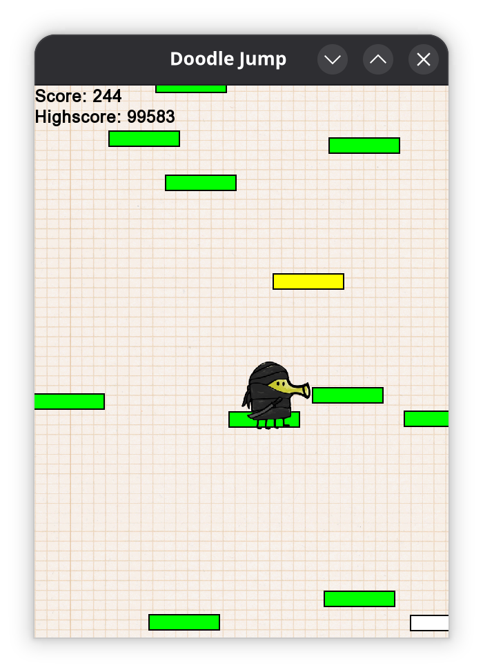

# C++ Doodle Jump Clone

An infinite-scrolling platformer game inspired by Doodle Jump. This project was developed as a university assignment for the Advanced Programming course (2024-2025). 

The primary focus of this project is software architecture. It demonstrates a clear separation between core game logic and graphical representation by compiling the logic into a standalone library. 



## Gameplay Features
The player constantly jumps and must navigate upwards by landing on generated platforms without falling off the screen. As the player jumps higher, the world shifts downwards to keep them in view, creating an effectively infinite vertical world.

**Platform Types:**
*   **Static (Green):** Standard platforms that stay in a fixed position.
*   **Horizontal (Blue):** Platforms that move back and forth horizontally.
*   **Vertical (Yellow):** Platforms that move up and down between fixed heights.
*   **Temporary (White):** Platforms that disappear after being jumped on once.

**Bonuses & Scoring:**
*   **Springs:** Grants a massive single bounce, provided the player lands exactly on top of it.
*   **Jetpacks:** Provides a sustained vertical boost that rockets the player upwards for approximately 3 seconds.
*   **Scoring System:** Driven by an Observer pattern, the score scales dynamically based on the player's maximum height progress.

## Technical Architecture

This project was built strictly using modern C++ features, specifically utilizing `std::unique_ptr` for exclusive ownership (like the World owning entities) and `std::shared_ptr` for subsystems, ensuring zero memory leaks without relying on raw pointers. All physical interactions rely on custom Axis-Aligned Bounding Box (AABB) collision detection built entirely from scratch.

**Design Patterns Implemented:**
*   **Model-View-Controller (MVC):** The World acts as the controller over logical entities (Model), completely decoupled from the SFML sprites and window (View).
*   **Observer:** Two-way implementation: logical entities notify the View of state changes, and a scoring component observes gameplay events to update the UI.
*   **Abstract Factory:** Allows the logic layer to spawn new platforms and bonuses without ever referencing SFML types.
*   **Singleton:** Guarantees a single consistent time base (`Stopwatch` using `std::chrono`) and reproducible world generation (`Random`).

## Tech Stack
*   **Language:** C++ 
*   **Graphics Library:** SFML 2.6.1
*   **Build System:** CMake (3.5 or higher)
*   **CI/CD:** CircleCI

## How to Build and Run
This project was developed and tested for Ubuntu 24.04.

**Dependencies:**
Ensure you have CMake, a C++ compiler (G++ 13.3.0 or Clang 18.1.3), and SFML installed on your system.

**Build Instructions:**
```bash
# Clone the repository
git clone https://github.com/Joe-Ayoub-UA/Doodle-Jump-Project.git
cd Doodle-Jump-Project

# Create build directory and run CMake
mkdir build && cd build
cmake ..

# Compile the project
make

# Run the game
./doodle_jump
```

Acknowledgments:
Project developed for the Advanced Programming course at the University of Antwerp.
